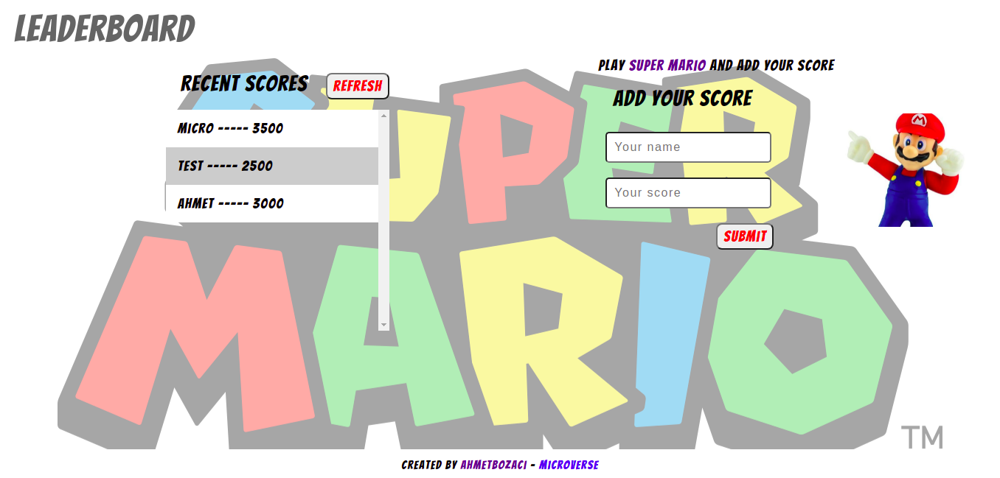

# Leaderboard

> CHANGE IT

## Built With

- HTML
- CSS
- SCSS
- Javacript
- Webpack

### Setup
To run code locally, open your terminal and follow these steps:

- `git clone (git@github.com:ahmetbozaci/leaderboard.git)`
- `cd leaderboard` 
- `npm install`
- `npm start` 
  
*After `npm start` webpack will automatically open your browser.*

## Authors

👤 **Ahmet Bozacı**
- Github:[ ahmtbozaci](https://github.com/ahmetbozaci)
- Twitter:[ ahmtbozaci](https://twitter.com/ahmtbozaci)
- LinkedIn:[ Ahmet Bozaci](https://www.linkedin.com/in/ahmetbozaci/)

## 🤝 Contributing

Contributions, issues, and feature requests are welcome!

Feel free to check the [issues page](../../issues/).

## Show your support

Give a ⭐️ if you like this project!

## 📝 License

This project is [MIT](./LICENCE) licensed.